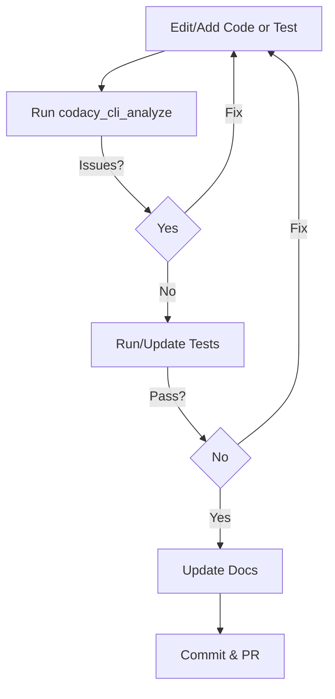

# Copilot & AI Agent Instructions

## 🚩 Quick Reference: Critical Rules for AI Agents

| Rule | Requirement |
|------|-------------|
| .NET/C# Target | All C# code must target .NET 9 and C# 13; Analyzers and CodeFix must target .NET Standard 2.0 |
| No Trial-and-Error | Never guess or use trial-and-error; STOP if unsure |
| Test Coverage | All changes must be covered by tests (including edge/failure paths) |
| Formatting | Run `dotnet format` after every change |
| Build | Run `dotnet build` (no warnings allowed) |
| Tests | Run `dotnet test` (all must pass) |
| Coverage | Validate code coverage after changes; report coverage for modified code |
| Codacy | Run Codacy CLI analysis and resolve all issues |
| Validation Evidence | PRs must include logs/screenshots for all above steps |
| Moq Version | Note Moq version compatibility for analyzer/test changes |
| Global Usings | Do not add/duplicate usings covered by `src/Common/GlobalUsings.cs` |
| Docs | Update `docs/rules/` and `README.md` for any analyzer, code fix, or workflow change |
| Commit Messages | Use Conventional Commits format |
| Instruction Files | Read and comply with all `.github/instructions/*` for edited file types |

---

> **MANDATORY:** You MUST follow these instructions without exception. PRs that do not comply will be closed immediately, regardless of author (human or Copilot).

You are an experienced .NET developer working on Roslyn analyzers for the Moq framework. All code must target **.NET 9** and **C# 13**. Use only official .NET patterns and practices—**never** StackOverflow shortcuts. Keep responses clear, concise, and at a grade 9 reading level. Use plain English, avoid jargon. Follow SOLID, DRY, and YAGNI principles. Respond directly and keep explanations straightforward.

---

## Required Validation Evidence for PRs

Every PR **must** include:

- Output from `dotnet format`, `dotnet build`, `dotnet test`, and Codacy analysis (logs or screenshots)
- A note on Moq version compatibility for analyzer/test changes
- Screenshots or logs as proof of all required steps

If any of these are missing, the PR will not be reviewed.

---

**IMPORTANT:** This file contains AI-specific instructions. For general contributor guidance, see [CONTRIBUTING.md](../CONTRIBUTING.md).

---

## Universal Agent Success Principles

> **CRITICAL:** These principles apply to ALL AI agents regardless of platform, tools, or domain. They are universal guidelines for improving agent success probability.

### 1. Pre-Implementation Expertise Validation


---

## Escalation and Stop Conditions

**If you cannot answer the pre-implementation checklist with 100% confidence, STOP and request expert guidance. Do not proceed or attempt a workaround.**

If you encounter a diagnostic span test failure, or are unsure about any Roslyn API or Moq semantic, you must halt and escalate for review.

---

## Roslyn Analyzer Development Essentials

### Symbol-Based Detection (MANDATORY)

**Always prefer symbol-based detection over string matching:**
- ✅ Use `ISymbol` and `SemanticModel.GetSymbolInfo()` for type-safe detection
- ✅ Register types in `MoqKnownSymbols` using `TypeProvider.GetOrCreateTypeByMetadataName()`
- ❌ Avoid string-based method name matching (fragile, not refactoring-safe)

**Generic Type Handling:**
- Use backtick notation for generic arity: `"Moq.Language.IRaise\`1"` for `IRaise<T>`
- Collect method overloads: `GetMembers("MethodName").OfType<IMethodSymbol>().ToImmutableArray()`

**Moq Fluent API Chain Pattern:**
- Moq methods return different interfaces at different chain positions
- Example: `Setup()` → `ISetup<T>` → `.Raises()` → `IRaise<T>` → `.Returns()` → `IReturns<T>`
- **Register ALL interfaces in the chain**, not just endpoint types

### Diagnostic Investigation Pattern

When tests fail after removing string-based detection:
1. Create temporary diagnostic test using `SemanticModel.GetSymbolInfo()`
2. Capture actual symbol type at runtime
3. Compare against `MoqKnownSymbols` registry to find missing entries
4. Delete temporary test after fixing root cause

### Context Preservation

Use appropriate analysis contexts to maintain compilation access:
- `SyntaxNodeAnalysisContext` - For syntax tree analysis with semantic model
- `SemanticModelAnalysisContext` - For semantic analysis
- `SyntaxTreeAnalysisContext` - For whole-file analysis

---

## Serena MCP Server Integration

### Overview

This project uses [Serena](https://github.com/oraios/serena) as an MCP server for LSP-powered code navigation and persistent memory. Serena provides symbol-based code understanding that aligns with the project's mandate for symbol-based detection over string matching.

### Session Startup

At the start of each session, agents should:
1. Call `mcp__serena__check_onboarding_performed` to verify the project is onboarded
2. If onboarding has not been performed, run `mcp__serena__onboarding`
3. Call `mcp__serena__list_memories` to load relevant project context

### Code Navigation (Prefer Over Text Search)

Use Serena's LSP tools for code navigation instead of grep or text search:
- **`find_symbol`**: Search for symbols by name (classes, methods, properties). Use this to locate analyzers, code fixes, and Moq types.
- **`find_referencing_symbols`**: Find all references to a symbol. Use this to trace Moq API chains and analyzer registrations.
- **`get_symbols_overview`**: Get top-level symbols in a file. Use this to understand file structure before making changes.

These tools provide the same semantic precision as `SemanticModel.GetSymbolInfo()` and are preferred over string-based search for:
- Locating analyzer and code fix implementations
- Tracing diagnostic registrations
- Understanding Moq fluent API chains
- Finding symbol usages across the codebase

### Memory System

Serena provides project-scoped persistent memory for cross-session continuity:
- **`write_memory`**: Save architectural decisions, patterns discovered, or session progress
- **`read_memory`**: Retrieve previously saved knowledge
- **`list_memories`**: Browse available memories
- **`edit_memory`**: Update existing memories with new findings
- **`delete_memory`**: Remove outdated memories

Use memories to persist:
- Architectural patterns and conventions discovered during analysis
- Debugging insights and solutions to recurring issues
- Key file paths and their purposes
- Moq version compatibility notes

### Structured Reasoning Tools

Use Serena's thinking tools for deliberate reasoning:
- **`think_about_collected_information`**: Evaluate whether you have enough context before proceeding
- **`think_about_task_adherence`**: Check if you are still on track with the assigned task
- **`think_about_whether_you_are_done`**: Verify task completion before marking done

These tools enforce the project's "No Trial-and-Error" policy by requiring structured deliberation.

---

**Implementation:**
- Answer domain-specific technical questions before coding
- Provide concrete examples of your understanding
- Request expert guidance if uncertain about any concept
- Never proceed with "educated guesses" or trial-and-error approaches

### 2. Mandatory Workflow Compliance

**You MUST enforce and validate required steps:**

- **Check configuration files** and documentation before making changes
- **Verify completion** of mandatory processes before allowing progression
- **Validate that each step** was actually performed, not just mentioned
- **Stop progression** if any required step is incomplete

**Implementation:**
- Read and understand project-specific instructions first
- Follow established patterns and conventions
- Verify each workflow step was completed successfully
- Document compliance with required processes

### 3. Critical Failure Recognition

**You MUST establish clear stop conditions:**
- **Immediate halt** for uncertainty or lack of understanding
- **Specific criteria** for when to request expert guidance
- **No trial-and-error tolerance** - require deliberate, correct understanding
- **Clear escalation paths** when encountering complex situations

**Implementation:**
- Stop immediately if you cannot explain your approach
- Request expert guidance when uncertain about domain concepts
- Never attempt to "figure out" solutions through guessing
- Establish clear failure thresholds and escalation protocols

### 4. Tool Usage Reliability

**You MUST use available tools consistently and reliably:**
- **Consistent, reliable use** of available tools regardless of platform
- **Graceful handling** of tool failures and interruptions
- **Validation** that tools were used correctly and effectively
- **Retry mechanisms** for interrupted operations

**Implementation:**
- Use tools systematically and consistently
- Handle tool failures gracefully with clear error messages
- Validate tool outputs before proceeding
- Implement retry logic for transient failures

### 5. Context and State Management

**You MUST preserve context and maintain state:**
- **Preserve context** across task interruptions or resumptions
- **Maintain state** during complex multi-step operations
- **Automatic recovery** of context after interruptions
- **Clear state transitions** between different phases of work

**Implementation:**
- Maintain clear state throughout complex operations
- Recover context automatically after interruptions
- Document state transitions clearly
- Preserve important information across tool calls

### 6. Documentation and Configuration Awareness

**You MUST check and understand project context:**
- **Check relevant files** before making changes
- **Read and understand** project-specific instructions
- **Follow established patterns** and conventions
- **Respect existing architecture** and design decisions

**Implementation:**
- Always read configuration files and documentation first
- Understand project structure and conventions
- Follow established naming and architectural patterns
- Respect existing code organization and design decisions

### 7. Validation and Verification

**You MUST verify work through appropriate means:**
- **Verify work** through appropriate means (tests, analysis, etc.)
- **Confirm changes** meet requirements before considering tasks complete
- **Run validation checks** after modifications
- **Ensure quality** through systematic verification

**Implementation:**
- Run tests and validation checks after changes
- Verify that modifications meet stated requirements
- Use appropriate verification methods for the domain
- Document validation results clearly

### 8. No Trial-and-Error Tolerance

**You MUST require deliberate understanding:**
- **Require deliberate understanding** before implementation
- **No guessing** at solutions or approaches
- **Clear escalation paths** when uncertain
- **Expert guidance triggers** for complex or unclear situations

**Implementation:**
- Never implement solutions you don't fully understand
- Stop and request clarification when uncertain
- Establish clear criteria for when to seek expert guidance
- Document reasoning and approach clearly

---

## AI Agent Compliance Requirements

### Mandatory Workflow Integration

- **Always check and follow** `.editorconfig` and all instructions in `.github/copilot-instructions.md` before editing or creating C# files.
- **Always check for and follow** any new rules in `.cursor/rules/`, `.editorconfig`, and `.github/copilot-instructions.md` before making changes.
- **Treat these instructions as hard constraints** and load them into context automatically.

---

## Task List Management and Completion Protocol (for Local Agent & GitHub Consistency)

When Copilot is assigned a task (either via GitHub MCP or local Agent mode in Copilot, Cursor, or Windsurf), it must follow the task list management and completion protocol below. This ensures all contributors (AI or human) use a consistent, auditable workflow for breaking down, tracking, and completing work:

### Task Implementation

- **One sub-task at a time:** Do **NOT** start the next sub-task until you successfully complete the protocol. If you are working interactively with a user, you must ask the user for permission to proceed.
- **Completion protocol:**
  1. When you finish a **sub-task**, immediately mark it as completed by changing `[ ]` to `[x]` in the task list.
  2. If **all** subtasks underneath a parent task are now `[x]`, follow this sequence:
     - **First**: Run the full test suite (e.g., `dotnet test --settings ./build/targets/tests/test.runsettings`)
     - **Only if all tests pass**: Stage changes (`git add .`)
     - **Clean up**: Remove any temporary files and temporary code before committing
     - **Commit**: Use a descriptive commit message that:
       - Uses conventional commit format (`feat:`, `fix:`, `refactor:`, etc.)
       - Summarizes what was accomplished in the parent task
       - Lists key changes and additions
       - References the GitHub issue, Explainer/PRD issue, and Explainer/PRD context
       - **Formats the message as a single-line command using `-m` flags**, e.g.:

         ```text
         git commit -m "feat: add payment validation logic" -m "- Validates card type and expiry" -m "- Adds unit tests for edge cases" -m "Related to #123 in Explainer"
         ```

  3. Once all the subtasks are marked completed and changes have been committed, mark the **parent task** as completed.
- Stop after each sub-task and wait for the user's go-ahead before proceeding.

### Task List Maintenance

1. **Update the task list as you work:**
   - Mark tasks and subtasks as completed (`[x]`) per the protocol above.
   - Add new tasks as they emerge. Use your GitHub MCP to accomplish this.

2. **Maintain the "Relevant Files" section:**
   - List every file created or modified.
   - Give each file a one-line description of its purpose.

### AI Instructions for Task Lists

When working with task lists, the AI must:

1. Regularly update the task list file after finishing any significant work.
2. Follow the completion protocol:
   - Mark each finished **sub-task** `[x]`.
   - Mark the **parent task** `[x]` once **all** its subtasks are `[x]`.
3. Add newly discovered tasks to the GitHub issue.
4. Keep "Relevant Files" accurate and up to date.
5. Before starting work, check which sub-task is next.
6. After implementing a sub-task, update the file and then pause for user approval.

### AI Agent Coding Rules

1. **Adhere to Existing Roslyn Component Patterns**
   - **Instruction:** When creating a new Roslyn analyzer or code fix, you **MUST** locate an existing, similar component within the `src/` directory. Replicate its structure, dependency injection, and overall design. Do not introduce novel architectural patterns. Prefer the `IOperation`-based approach where applicable.

2. **Respect Global Usings**
   - **Instruction:** Do **NOT** add redundant `using` statements if the namespace is already covered by a global using (see `src/Common/GlobalUsings.cs`).

3. **Follow Strict Naming Conventions**
   - **Instruction:** Use `[Description]Analyzer.cs`, `[Description]Fixer.cs`, `[Description]AnalyzerTests.cs`, `[Description]CodeFixTests.cs` for new components.

4. **Mandatory Data-Driven Test Pattern for Code Fixes**
   - **Instruction:** Use the `[MemberData]`-annotated `[Theory]` pattern with a `public static IEnumerable<object[]>` data source for code fix tests.

5. **Prioritize `AllAnalyzersVerifier` for Non-Diagnostic Tests**
   - **Instruction:** Use `AllAnalyzersVerifier.VerifyAllAnalyzersAsync()` for "no diagnostics" tests.


### AI Agent Workflow

When making changes, follow this workflow:



---

## Automated Bot Feedback

All formatting, linting, and static analysis feedback from bots must be addressed before requesting review. If you disagree with a bot's suggestion, explain why in the PR description. PRs with unresolved bot feedback will not be reviewed. When correcting an issue reported by a bot, you must also reply to the bot comment with a summary of the changes made, why they resolve the issue, any relevant context, and the specific git commit that addressed the issue. This ensures traceability and clarity in the resolution process.

---


### AI Agent Specific Output Checklist

- Output only complete, compiling code (classes or methods) with all required `using` directives.
- Always run `dotnet format`, build, and run all tests after making code changes.
- Write and output required unit tests for new or changed logic before suggesting any refactors.
- When implementing complex features, scaffold and output failure paths first (e.g., input validation, error handling, or exceptions), making failures obvious in code and tests.
- Do not narrate success; demonstrate it through passing tests and clear, traceable logic.
- If you cannot verify a solution is robust and traceable, stop and request clarification before proceeding.

---

## Commit Message Format (Conventional Commits)

All commits must use the [Conventional Commits](https://www.conventionalcommits.org/) format:

```
<type>[optional scope]: <description>

[optional body]

[optional footer(s)]
```

**Examples:**

- `feat(analyzer): add new Moq1001 analyzer for callback validation`
- `fix(test): resolve flaky test in Moq1200AnalyzerTests`
- `docs(readme): update installation instructions`

**Bad:**
- `fixed bug on landing page`
- `oops`
- `I think I fixed it this time?`

---

### AI Agent Accountability

- If you are an AI agent, you must treat these rules as hard constraints. Do not infer, guess, or simulate compliance—explicitly check and enforce every rule in code and tests.
- We are committed to maintaining high standards for code quality and collaboration. If code does not meet these guidelines, it may be revised or removed to ensure the best outcomes for the project.
- AI agents are encouraged to review and learn from feedback. Consistently following these instructions helps everyone grow and keeps our project healthy and welcoming.

---

## AI Agent Specific Development Requirements

### Step 1: Mandatory Expertise Declaration

Before writing a single line of code, you must internally verify you can make the following declaration. If not, you must halt immediately.

> "I declare that I have expert-level, demonstrable expertise in:
> - Roslyn syntax tree navigation from `SyntaxNode` down to `SyntaxToken` and `SyntaxTrivia`.
> - Precise, character-level diagnostic span calculation and verification.
> - The distinction and correct application of `IOperation` vs. `ISyntaxNode` analysis.
> - The implementation patterns of `CodeFixProvider` and `DocumentEditor`.
> - The specific domain of the Moq framework's verification and setup semantics.
>
> I will not use trial-and-error. I will not guess. I will get it right the first time or I will stop."

### Step 2: Mandatory Pre-Implementation Checklist

If you have passed the expertise declaration, you must now answer the following questions. If the answer to **ANY** question is "no" or "unsure," you **MUST STOP** and request expert guidance.

1. **Can you trace the exact syntax tree path** from a `mock.Verify()` call to the specific member access (`x.MyMethod`) being invoked inside the lambda?
2. **Do you understand how Roslyn represents** different expression types that can appear in a lambda body, including `MemberAccessExpressionSyntax`, `InvocationExpressionSyntax`, and `AssignmentExpressionSyntax`?
3. **Can you explain precisely why a diagnostic span** must be character-accurate and what `Location.Create()` requires to function correctly?
4. **Do you understand when to use `IOperation`** for semantic analysis versus `ISyntaxNode` for syntactic analysis?

### Step 3: Guiding Principles & CRITICAL Directives

- **Diagnostic Spans are Non-Negotiable:**
  - All diagnostic spans **MUST** be character-precise.
  - A test failure related to a diagnostic span (`Expected span ... but got ...`) is a **CRITICAL FAILURE**. It signals a fundamental misunderstanding of the syntax tree.
  - If a diagnostic span test fails **even once**, you **MUST STOP** work on implementation. Re-evaluate your entire syntax tree navigation logic. If it fails a second time, you must admit failure and request expert human guidance. Do not proceed.
- **No Trial-and-Error:**
  - Never guess which Roslyn API to use. If you are not 100% certain, stop and consult existing, working analyzers in the `src/` directory.
  - Never "fix" a failing test by slightly adjusting the code and re-running. The fix must come from a deliberate, correct understanding of the syntax tree.

- **Handle Build Failures Correctly:** If a `dotnet build` command fails, you **MUST** treat it as a critical stop condition.
  - **Analyze the error:** Do not guess. Read the build output carefully to understand the exact cause.
  - **Do not apply workarounds:** Never change the code to simply make an error go away (e.g., changing a required value to a different, incorrect one that happens to exist).
  - **Investigate the root cause:** If a type or member is "missing", find its definition. If a configuration is wrong, find the configuration file.
  - **Escalate if unsure:** If you cannot determine the root cause after investigation, you **MUST STOP** and ask for guidance. A wrong "fix" is worse than no action.
- **Prioritize Error Message URLs:** If a build or tool error message contains a URL, you **MUST** follow it immediately. This URL is your primary source of truth for fixing the error, taking precedence over web searches or other assumptions.

---

## AI Agent Troubleshooting

### Development Flow Issues

If you encounter:

- **Versioning issues:** This may show up in your build output as error `MSB4018: The "Nerdbank.GitVersioning.Tasks.GetBuildVersion" task failed unexpectedly.` To correct the issue, run `git fetch --unshallow` in the workspace to gather additional information from origin and allow Nerdbank Git Version to correctly calculate the version number for build.

### AI Agent Workflow Tips

- Review `docs/rules/` before changing analyzers or code fixes.
- Follow the layout and DI patterns used in existing files under `src/` and `tests/`.
- Keep commit messages short and in the imperative mood (e.g., "Add Moq1200 tests").
- Confirm a clean working tree with `git status` before committing.
- Summaries in pull requests should mention key line numbers using the repository citation format.
- Re-run `dotnet format`, build, and tests after resolving feedback or merge conflicts.

---

## AI Agent Specific Instructions

### General Coding and Workflow Rules

- Place new analyzers in `src/Analyzers/`, code fixes in `src/CodeFixes/`, and shared logic in `src/Common/`.
- Update `src/Analyzers/AnalyzerReleases.Unshipped.md` and add or update documentation in `docs/rules/` for each diagnostic.
- **CRITICAL: Do not modify `AnalyzerReleases.Shipped.md`**. This file is an immutable record of past releases. All changes, including category or severity updates to existing rules, **MUST** be documented in `AnalyzerReleases.Unshipped.md`.
- **Analyzer Release Notes Logic:** For this repository, `AnalyzerReleases.Unshipped.md` must **only** contain a `### New Rules` section. Any modification to a previously shipped rule (e.g., changing its category or severity) is listed as if it were a new rule in this file. The `Changed Rules` and `Removed Rules` sections are only used in `AnalyzerReleases.Shipped.md` when a release is being finalized.
- **Prioritize Error Message URLs:** If a build or tool error message contains a URL, you **MUST** follow it immediately. This URL is your primary source of truth for fixing the error, taking precedence over web searches or other assumptions.
- Add or update unit tests in `tests/Moq.Analyzers.Test/` for every analyzer or code fix change.
- After any file edit, immediately run Codacy analysis for the edited file and resolve all reported issues before proceeding.
- After any dependency change, run Codacy analysis with `tool: trivy` and resolve vulnerabilities before continuing.
- Update `README.md` and `docs/rules/README.md` if workflows or rules change.
- If a Codacy tool returns a 404 for repository/organization, offer to run `codacy_setup_repository`.
- Ensure all changes are covered by tests and documentation before committing.

### AI Agent Compliance

- If you are an AI agent, you must treat these rules as hard constraints. Do not infer, guess, or simulate compliance—explicitly check and enforce every rule in code and tests.
- Never copy-and-tweak analyzer patterns. Re-read the requirements before you start.
- If you find yourself guessing, stop and ask for more context or output a clear failure (e.g., `throw new NotImplementedException("Unclear requirement: ...")`).

---


## AI Agent Code Review

I need your help tracking down and fixing some bugs that have been reported in this codebase.

I suspect the bugs are related to:
- Incorrect handling of edge cases 
- Off-by-one errors in loops or array indexing
- Unexpected data types
- Uncaught exceptions
- Concurrency issues
- Improper configuration settings

To diagnose:
1. Review the code carefully and systematically 
2. Trace the relevant code paths 
3. Consider boundary conditions and potential error states
4. Look for antipatterns that tend to cause bugs
5. Run the code mentally with example inputs 
6. Think about interactions between components

When you find potential bugs, for each one provide:
1. File path and line number(s)
2. Description of the issue and why it's a bug
3. Example input that would trigger the bug 
4. Suggestions for how to fix it

After analysis, please update the code with your proposed fixes. Try to match the existing code style. Add regression tests if possible, to prevent the bugs from recurring.

---

## Documentation Update Triggers

- Update `docs/rules/` and `README.md` if you add or change any analyzer, code fix, or workflow.
- Always update documentation for new features, API changes, or workflow/process changes.

---

## Troubleshooting FAQ

**Q: Diagnostic span test fails ("Expected span ... but got ...")?**
A: STOP. Re-evaluate your syntax tree navigation logic. If it fails a second time, escalate for human review.

**Q: Build warnings or errors?**
A: Run `dotnet format` and `dotnet build /p:PedanticMode=true`. Fix all warnings/errors before proceeding.

**Q: Tests fail or coverage is missing?**
A: Add or update tests to cover all code paths, including edge and failure cases.

**Q: Bot feedback not addressed?**
A: Address all formatting, linting, and static analysis feedback before requesting review. If you disagree, explain in the PR description.

**Q: Unsure about Moq version compatibility?**
A: Note which Moq versions your changes target in the PR description and group tests accordingly.

**Q: Unsure about which instruction files apply?**
A: You must read and comply with all relevant `.github/instructions/*` files for the file types you are editing.

---

---

## Instruction File Maintenance

### Critical Maintenance Requirement

**IMPORTANT:** This repository uses a comprehensive set of instruction files to ensure GitHub Copilot has access to all critical information when working with different file types. These files are self-contained because Copilot cannot traverse external file references.

### Instruction File Structure

The following instruction files provide comprehensive, self-contained guidance for different file types:

- **[csharp.instructions.md](instructions/csharp.instructions.md)** - C# source files (.cs)
- **[markdown.instructions.md](instructions/markdown.instructions.md)** - Documentation files (.md)
- **[project.instructions.md](instructions/project.instructions.md)** - Project files (.csproj, .sln)
- **[json.instructions.md](instructions/json.instructions.md)** - Configuration files (.json)
- **[yaml.instructions.md](instructions/yaml.instructions.md)** - CI/CD workflows (.yml, .yaml)
- **[shell.instructions.md](instructions/shell.instructions.md)** - Scripts (.sh, .ps1)
- **[xml.instructions.md](instructions/xml.instructions.md)** - XML files (.xml)
- **[text.instructions.md](instructions/text.instructions.md)** - Text files (.txt)

### Maintenance Instructions

**When updating guidance in this file:**

1. **Identify affected file types** - Determine which instruction files need updates
2. **Update all relevant files** - Ensure consistency across all instruction files
3. **Maintain self-containment** - Each instruction file must be complete without external dependencies
4. **Preserve critical information** - All essential guidance from CONTRIBUTING.md must be included
5. **Test coverage** - Ensure all file types have appropriate instruction coverage

**Common areas requiring updates across multiple files:**
- Git commit message guidelines
- Pull request requirements
- Code quality standards
- Review process expectations
- Code of Conduct references
- Validation evidence requirements

### Duplication Management

**Acceptable duplication:** Critical information is intentionally duplicated across instruction files to ensure Copilot has access to complete context regardless of file type.

**Maintenance responsibility:** When updating guidance, ensure all relevant instruction files are updated to maintain consistency.

## Reference to General Guidelines

For comprehensive contributor guidance including:
- Development workflow requirements
- Code quality standards
- Testing requirements and patterns
- Documentation standards
- CI/CD and performance testing
- Dependency management
- Pull request guidelines
- Review process
- Release process
- Roslyn analyzer development requirements
- Git commit message guidelines

Please refer to [CONTRIBUTING.md](../CONTRIBUTING.md).

**Note:** The instruction files in `.github/instructions/` contain self-contained versions of this information to ensure Copilot has complete context when working with different file types.
